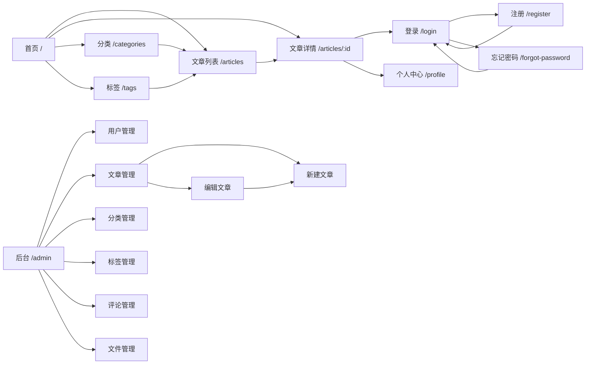

# Evenstar Writings · 编码前准备（B/C/D/E）

> 配套文件：`docs/openapi.yaml`（A 部分，OpenAPI 3.0 初稿，可直接导入 Apifox）
> 本文件包含：B 前端低保真页面结构、C 测试方案、D Git/工程收尾、E 最终待拍板事项。

---

## B. 前端低保真页面结构

前后端分离，Vue3 + Element Plus，前后台同一项目。路由分前台（`/`）与后台（`/admin`），后台套一层 Admin 布局（侧边栏 + 顶栏）。

### B.1 路由总表

| 路由 | 页面 | 登录 | Admin | 说明 |
|---|---|---|---|---|
| `/` | 首页 | 否 | 否 | 门户首页 |
| `/articles` | 文章列表 | 否 | 否 | 全部文章 + 筛选 |
| `/articles/:id` | 文章详情 | 否 | 否 | 正文 + 评论 |
| `/categories` | 分类页 | 否 | 否 | 分类聚合 |
| `/tags` | 标签页 | 否 | 否 | 标签聚合 |
| `/login` | 登录 | 否 | 否 | 已登录跳回 |
| `/register` | 注册 | 否 | 否 | — |
| `/forgot-password` | 忘记密码 | 否 | 否 | — |
| `/profile` | 个人中心 | 是 | 否 | 改昵称/头像/密码 |
| `/admin` | 后台统计 | 是 | 是 | 后台首页 |
| `/admin/users` | 用户管理 | 是 | 是 | — |
| `/admin/articles` | 文章管理 | 是 | 是 | 列表 |
| `/admin/articles/new` | 新建文章 | 是 | 是 | — |
| `/admin/articles/:id/edit` | 编辑文章 | 是 | 是 | — |
| `/admin/categories` | 分类管理 | 是 | 是 | — |
| `/admin/tags` | 标签管理 | 是 | 是 | — |
| `/admin/comments` | 评论管理 | 是 | 是 | — |
| `/admin/uploads` | 文件管理 | 是 | 是 | — |

路由守卫：`/profile` 需登录；`/admin/*` 需登录且 `role=1`（前端守卫只做体验层，安全以后端 AdminOnly 中间件为准）。

### B.2 前台页面

#### 1. 首页 `/`
- **用途**：门户入口，展示站点概览。
- **主要区域**：顶栏（logo/分类/标签/登录入口）→ 首屏（最新文章 hero）→ 文章列表（最新 N 条）→ 侧栏（热门文章）→ 底栏。
- **API**：`GET /api/articles?page=1&page_size=N`（最新）、`GET /api/articles/hot`（热门）、`GET /api/categories`、`GET /api/tags`。
- **跳转**：文章卡片 → `/articles/:id`；分类/标签 → 对应页；登录按钮 → `/login`。
- **状态**：骨架屏加载；空列表显示「暂无文章」。

#### 2. 文章列表 `/articles`
- **用途**：全部已发布文章分页浏览。
- **主要区域**：筛选栏（分类下拉 / 标签下拉 / 关键词搜索框）→ 文章卡片列表 → 分页器。
- **API**：`GET /api/articles?page&page_size&category_id&tag_id&keyword`；`GET /api/categories`、`GET /api/tags`（筛选项）。
- **状态**：加载骨架屏；无结果显示「没有匹配的文章」；关键词为空时清空筛选。

#### 3. 文章详情 `/articles/:id`
- **用途**：阅读正文 + 浏览 + 评论。
- **主要区域**：
  - 文章头：标题、作者、分类/标签、发布时间、浏览量
  - 正文：Markdown 渲染（DOMPurify 防 XSS）
  - 评论区：一级评论（置顶在前，多条按 top_time 倒序）+ 二级评论（挂在对应一级下），回复展示「张三 → 李四」
- **API**：`GET /api/articles/{id}`、`GET /api/articles/{id}/comments`、`POST /api/articles/{id}/comments`、`DELETE /api/comments/{id}`（删自己的评论）。
- **评论交互**：未登录点「写评论」→ 弹登录；登录后可发一级评论、回复一级/二级评论（回复二级时回复框显示「回复 @某人」）；自己的评论可删除。
- **状态**：正文加载失败 → 错误页 + 返回按钮；评论分页加载更多；评论为空 →「还没有评论，来抢沙发」；软删评论显示「该评论已删除」；注销用户显示「已注销用户」；置顶评论带「置顶」角标。

#### 4. 分类页 `/categories`
- **用途**：分类聚合展示。
- **主要区域**：分类卡片（名称 + 文章数）→ 点击进入带 `category_id` 的文章列表。
- **API**：`GET /api/categories`。
- **状态**：空显示「暂无分类」。

#### 5. 标签页 `/tags`
- **用途**：标签聚合展示。
- **主要区域**：标签云（名称 + 文章数）→ 点击进入带 `tag_id` 的文章列表。
- **API**：`GET /api/tags`。
- **状态**：空显示「暂无标签」。

#### 6. 登录 `/login`
- **用途**：邮箱 + 密码登录。
- **主要区域**：邮箱 / 密码输入框 → 登录按钮。
- **API**：`POST /api/auth/login`。
- **滑块验证**：正常登录不出现；连续失败 3 次后出现滑块，前端取得 `captcha_verify_param` 随请求提交。
- **状态**：密码错误提示；触发限流（429）提示「请稍后再试」；登录成功存 token，`role=1` 跳 `/admin`，否则跳回上一页。
- **跳转**：忘记密码 → `/forgot-password`；注册 → `/register`。

#### 7. 注册 `/register`
- **用途**：注册成为可评论用户。
- **主要区域**：用户名 / 邮箱 / 邮箱验证码（+「发送验证码」按钮）/ 密码 / 昵称（选填）→ 注册按钮。
- **API**：`POST /api/auth/send-code`、`POST /api/auth/register`。
- **滑块验证**：点「发送验证码」和「注册」时每次都需滑块（前端先取 `captcha_verify_param`）。
- **状态**：发送验证码 60s 倒计时；验证码错误提示；注册成功直接返回 token 自动登录（跳 `/` 或 `/profile`）。

#### 8. 忘记密码 `/forgot-password`
- **用途**：重置密码。
- **主要区域**：邮箱 / 邮箱验证码（+发送按钮）/ 新密码 → 提交按钮。
- **API**：`POST /api/auth/send-code`（type=reset）、`POST /api/auth/reset-password`。
- **滑块验证**：每次必验。
- **状态**：成功后提示「重置成功，请重新登录」，跳 `/login`（后端 token_version+1，旧 token 失效）。

#### 9. 个人中心 `/profile`
- **用途**：查看/修改自己资料。
- **主要区域**：头像（上传/回退默认图）、昵称、邮箱（只读）、修改密码表单、登出按钮。
- **API**：`GET /api/user/profile`、`PUT /api/user/profile`、`POST /api/upload`（scene=avatar）、`PUT /api/user/password`。
- **状态**：头像上传失败提示；每月 5 次头像上传超限提示（429）；改密成功后清 token 跳登录。

### B.3 后台页面（Admin 布局）

所有后台页面 AdminOnly，接口返回 403 时统一跳登录/提示无权限。

#### 1. 后台统计 `/admin`
- **用途**：后台首页卡片。
- **主要区域**：4 个卡片（文章数 / 评论数 / 用户数 / 总浏览量）。
- **API**：`GET /api/admin/stats`。
- **状态**：加载骨架；失败显示错误提示。

#### 2. 用户管理 `/admin/users`
- **用途**：用户列表 + 删除 + 禁用/解禁。
- **主要区域**：搜索框 → 用户表格（用户名/昵称/邮箱/角色/状态/注册时间/操作）→ 分页。
- **API**：`GET /api/admin/users`、`DELETE /api/admin/users/{id}`、`PUT /api/admin/users/{id}/status`。
- **状态**：删除弹确认框；禁用/解禁弹确认框；不能操作自己（按钮置灰 + 后端兜底）；空列表提示。

#### 3. 文章管理 `/admin/articles`
- **用途**：文章列表（含草稿）+ 新建入口 + 删除。
- **主要区域**：状态筛选（全部/草稿/发布）+ 搜索 → 文章表格（标题/状态/浏览量/发布时间/操作）→ 分页；「新建文章」按钮。
- **API**：`GET /api/admin/articles`、`DELETE /api/admin/articles/{id}`。
- **跳转**：新建 → `/admin/articles/new`；编辑 → `/admin/articles/:id/edit`。
- **状态**：删除弹确认框（软删）；空列表提示。

#### 4. 新建文章 `/admin/articles/new`
- **用途**：新建文章。
- **主要区域**：标题 / 摘要 / 封面（上传，scene=article）/ Markdown 编辑器（md-editor-v3）/ 分类多选 / 标签多选 / 状态（草稿/发布）/ 保存按钮。
- **API**：`POST /api/admin/articles`、`GET /api/categories`、`GET /api/tags`、`POST /api/upload`（scene=article，封面图）。
- **状态**：上传失败提示；保存成功后跳文章管理；草稿与发布通过 status 切换，无单独发布按钮。

#### 5. 编辑文章 `/admin/articles/:id/edit`
- **用途**：编辑文章。
- **主要区域**：同新建（数据回填，分类/标签预选）。
- **API**：`GET /api/admin/articles/{id}`（回填，含 category_ids/tag_ids）、`PUT /api/admin/articles/{id}`、`POST /api/upload`。
- **状态**：加载失败提示；保存成功跳文章管理。

#### 6. 分类管理 `/admin/categories`
- **用途**：分类增删改。
- **主要区域**：分类表格（名称/文章数/操作）→ 新建/编辑弹窗 → 删除按钮。
- **API**：`GET /api/categories`、`POST /api/admin/categories`、`PUT /api/admin/categories/{id}`、`DELETE /api/admin/categories/{id}`。
- **状态**：删除弹确认框（硬删，中间表 CASCADE）；重名提示（409）。

#### 7. 标签管理 `/admin/tags`
- **用途**：标签增删改（与分类镜像）。
- **API**：`GET /api/tags`、`POST /api/admin/tags`、`PUT /api/admin/tags/{id}`、`DELETE /api/admin/tags/{id}`。
- **状态**：同分类管理。

#### 8. 评论管理 `/admin/comments`
- **用途**：评论列表 + 删除 + 置顶/取消置顶。
- **主要区域**：文章筛选 → 评论表格（文章/作者/内容/置顶状态/时间/操作）→ 分页。
- **API**：`GET /api/admin/comments`、`DELETE /api/admin/comments/{id}`、`PUT /api/admin/comments/{id}/top`。
- **状态**：删除弹确认框；未置顶显示「置顶」、已置顶显示「取消置顶」；二级评论置顶按钮置灰（后端兜底返回错误）。

#### 9. 文件管理 `/admin/uploads`
- **用途**：uploads 文件列表 + 删除。
- **主要区域**：scene 筛选 → 文件表格（缩略图/文件名/场景/大小/上传者/时间/操作）→ 分页。
- **API**：`GET /api/admin/uploads`、`DELETE /api/admin/uploads/{id}`。
- **状态**：删除时若返回 409（被文章引用），弹确认框展示引用文章列表，管理员确认后带 `force=true` 重发删除。

### B.4 页面关系图



---

## C. 测试方案（简单，不过度设计）

### C.1 单元测试（go test，聚焦纯逻辑）

| 对象 | 测什么 |
|---|---|
| `pkg/jwt` | 生成/解析 token、过期、claims 读写（user_id/username/tv） |
| 密码工具 | bcrypt 加密 + 校验、密码规则校验（8 位 + 字母 + 数字） |
| 评论层级归位（Service） | 回复二级评论时 parent_id 自动取一级；reply_to_id 正确记录 |
| 浏览量计算（Service） | views = MySQL views + Redis 增量；GETDEL 回写逻辑（可 mock） |
| 权限判断（Service） | 用户删自己评论 / 管理员删任意 / 管理员不能删/禁自己 |
| 分页计算 | page/page_size/total/total_page 边界（page 越界、size 上限） |
| 错误码映射 | 业务 code → HTTP 状态码（http_status.go 的 switch） |

> 用 Go 标准库 `testing` + 必要时 `gomock`/`testify`，不引入重框架。Redis 相关用接口 mock 或 miniredis。

### C.2 API / 集成测试

重点验证（走真实路由 + 内存/测试库）：

- 注册：成功自动登录、邮箱/用户名重复、验证码错误、密码规则
- 登录：成功、密码错误、禁用用户（403）、限流（429）
- 忘记密码：验证码校验、成功后旧 token 失效
- JWT / token_version：改密/重置/禁用/删除后旧 token 401
- 用户禁用：禁用后无法登录/评论
- 用户删除：软删、不能删/禁自己
- 管理员权限：普通用户访问 `/api/admin/*` 返回 403
- 文章：创建/编辑、草稿↔发布（published_at 首次写入）、前台只出已发布
- 评论：两级归位、置顶/取消置顶、二级评论置顶报错、删除自己/他人
- OSS 上传：scene 权限、大小/类型校验、avatar 月次数限流
- uploads 删除：有引用 409 + force 强制删除
- Redis 限流：评论 1 分钟 5 条、登录限流

> 用真实 MySQL + Redis 的测试容器或本地实例；OSS/邮件/验证码用 mock（不真调阿里云）。

### C.3 手工测试（无需自动化）

- 前端页面视觉、响应式、交互流畅度
- Markdown 渲染效果、代码高亮、XSS 过滤（DOMPurify）
- 滑块验证的前端交互（阿里云 JS SDK）
- 头像/封面默认资源回退显示
- 浏览器兼容性

### C.4 冒烟测试（Docker Compose 启动后）

```
前端能访问 → Nginx 正常 → /api 能访问 → Gin 正常 → MySQL 正常 → Redis 正常
→ 注册 → 登录 → 管理员登录 → 创建文章 → 发布文章 → 前台查看 → 评论 → 上传
```

---

## D. Git / 工程收尾

以下为**需要处理**的项目，均未动手（等你确认后一起做）：

### D.1 必须处理（否则推 GitHub 会泄密/带脏东西）

1. **根目录 `.gitignore` 缺失**：目前只有 `backend/.gitignore` 和 `.idea/.gitignore`。根目录需要补一份 `.gitignore`，忽略：
   - `.idea/`、`.vscode/`
   - `.workbuddy/`（⚠️ 里面 `memory/2026-08-31.md` 记录了管理员随机密码 `jKmAhn5tnwk0M6k9` 和 MySQL 密码，一旦 `git add .` 就会泄密）
   - `backend/configs/config.yaml`、`.env`、`logs/`、`coverage.*`（`backend/.gitignore` 已覆盖 backend 内部，但根层要兜底）
2. **`.workbuddy/` 内存文件含敏感信息**：需确认 `memory/2026-08-31.md` 里的管理员密码、MySQL 密码是否要脱敏（即便 gitignore，本地明文仍在）。
3. **暂存区状态混乱**：`git status` 显示大量旧 tuyou 实体文件处于 `AD`（已暂存 + 工作区已删除）状态。提交前需 `git rm --cached` 清理，否则旧文件会被一并提交。

### D.2 建议处理（推 GitHub 前）

4. **go.mod 模块名**：当前 `module evenstar`，推 GitHub 前应改为 `github.com/Danche23/Evenstar-Writings`，并同步替换代码里所有 `evenstar/...` import。
5. **`/api/v1/health` 前缀不一致**：代码里健康检查是 `/api/v1/health`，业务是 `/api`，建议统一（如 `/api/health`），属清理项。

### D.3 已确认安全（无需处理）

- `backend/configs/config.yaml`（真实 MySQL 密码）已被 `backend/.gitignore` 忽略，且未暂存 ✅
- `backend/.env.example` 是模板（无真实密钥）✅
- 未发现真实 `.env` 文件 ✅

---

## E. 最终待拍板事项

以下是我在写 OpenAPI 初稿时发现的、**真正影响前后端契约**的小点，需你确认；确认后即可进入编码阶段。

### 1. 滑块验证字段命名（需确认）
阿里云 JS SDK 返回的参数名是 `captchaVerifyParam`（驼峰），但后端全站 JSON 用 snake_case。
我按后端惯例统一为 **`captcha_verify_param`**（openapi.yaml 已如此写）。
→ 你确认用 `captcha_verify_param`，还是保持阿里云原样的 `captchaVerifyParam`？

### 2. 登录触发滑块的信号（需确认）
「login 连续失败 3 次后要滑块」，但前端怎么知道何时该弹滑块？我建议：
- 后端在需要滑块时返回特定业务错误码（我拟新增 `1007 captcha_required`）+ `data.need_captcha = true`；
- 前端收到该标志后弹滑块，取 `captcha_verify_param` 再重发登录。
→ 需要你确认这个「错误码 + need_captcha 标志」的契约，并同意新增 `1007 captcha_required`、`1008 captcha_verify_failed` 两个业务码到 `code.go`。

### 3. 评论「该评论已删除」的字段（小点，默认按我方案）
软删父评论、回复保留、前台显示「该评论已删除」，需要 API 能表达「这条是已删除的占位」。我在评论 schema 里加了 `deleted: boolean` 字段（后端用 Unscoped 取树）。
→ 默认按此方案，除非你有异议。

### 4. 分页多了 `total_page`（极小点，默认保留）
代码里 `PageResponse` 有 `total_page` 字段，但你给的分页结构只有 `{list,total,page,page_size}`。我按代码加了 `total_page`。
→ 可留可删，默认保留。

---

### 结论

如果以上 4 点（重点是 1、2）你确认没问题，那么：

**「设计和编码前准备已经完成，可以进入编码阶段。」**
